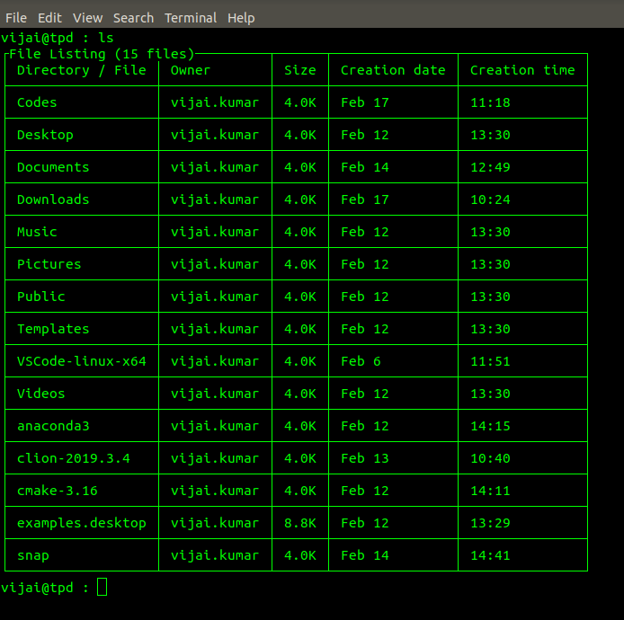

Fabric Scripts
=============

Just for fun, i am writing wrappers around some of the tools that i commonly use.
In most cases, it just formats them nicely. For example, here is the wrapper i wrote around
ls command

